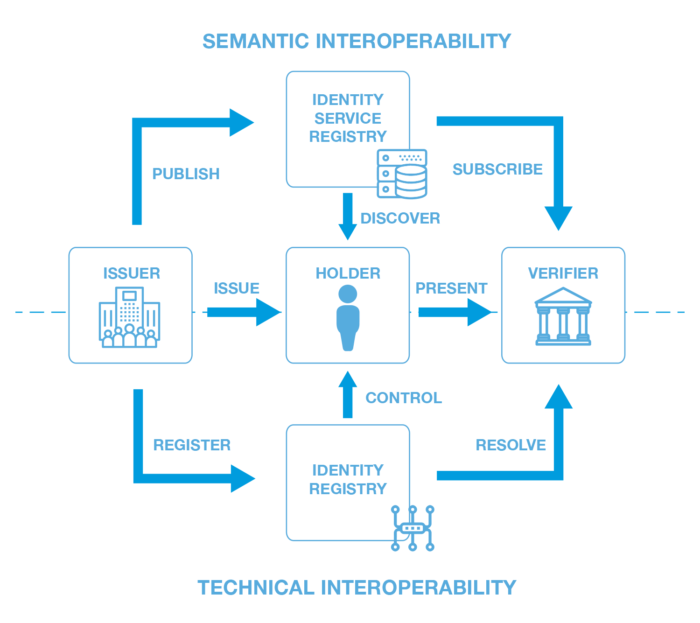
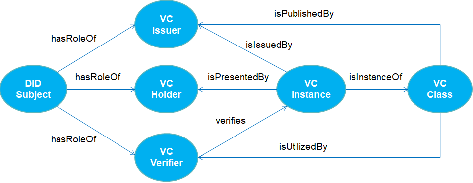

# SSIDDI
Self-Sovereign Identity Description, Discovery and Interoperability

## Motivation
Core aspects of the Self-Sovereign Identity (SSI) model are specified in the W3C Primers related to [Decentralized IDentifier (DID)](https://www.w3.org/TR/did-core/) and [Verifiable Credential (VC)](https://www.w3.org/TR/vc-data-model/). In particular, the VC specification defines a Verifiable Data Registry (VDR) responsible for "mediating the creation and verification" of all elements (identifiers, verifiable credential schemas, revocation registries, and so on) "which might be required to use verifiable credentials". We argue that the described data registry may have significant shortcomings due to the lack of sematic interoperability. In fact, the relevant questions on who, what and how can operate with those verifiable credentials will inevitably arise in any practical implementation of [VDR](https://www.w3.org/TR/vc-data-model/).

Answering these questions is especially important within the decentralized models in which identity owners are involved into trustworthy relationships, such as VC issuance in the Issuer-Holder pair and VC verification in the Holder-Verifier pair. If we consider these processes as parts of the whole VC service, an Issuer becomes a service provider meanwhile Holder and Verifier converts to service consumers. From the interoperability point of view, it implies that all necessary service-related information must be previously published by Issuers in order to be later discovered and utilized by Holders and Verifiers.

In the case of semantic interoperability related to web services, such an approach based on the [Universal Description, Discovery and Interaction (UDDI)](http://uddi.xml.org/specification) specification has been developed. We notice that the UDDI architecture can be easily adjusted to the VC services whereas the original data model of UDDI seems to be obsolete and intransferable to [VDR](https://www.w3.org/TR/vc-data-model/). In our opinion, an appropriate and up-to-date solution should be be searched for within the frame of [Web Ontology Language (OWL)](https://www.w3.org/TR/owl2-syntax/).

By combining an UDDI-like registry architecture with an OWL-compliant data model, we pretend to design a generalized solution on semantic description, discovery and interoperability for self-sovereign identity and verifiable credentials.

## Key Requirements
**Ontology Model:**
- For legal persons’ data only (Privacy-by-Design)
- Multi-context, multi-language and multi-purpose
- Based on OWL / RDFS graphs
- Simple and partially flexible

**Registry Architecture:**
- Lightweight design (APIs)
- Public reading, Authorized writing (TAs, ACs, etc.)
- Highly-Available and Synchronized Registries

**Search Engine:**
- Query languages (GraphQL, SPARQL)
- Multi-format support (JSON, XML)
- Effective and Efficient

## Architecture

### Credential Lifecycle
Generally, the lifecycle of verifiable credentials can be divided into the following stages:
1. Definitions
2. Registrations
3. Operations

## Data Model
The data model must contain the following elements:
-	White Pages (Who): Provider Description including Contact Info, DID URLs, etc. 
-	Yellow Pages (What): Service Description including Taxonomies, VC Catalogues, etc.
-	Green Pages (How): Interface Description including Technical Info, VC Classes including Schema and Credential Definitions, Policies, etc.

### Ontology Graphs

## Opened Questions

